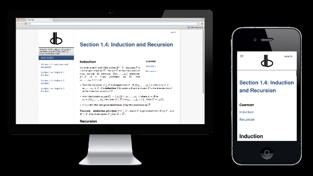

Multipage Theme for GetSimple CMS
=================================

DESCRIPTION
-----------

Multipage Theme for GetSimple CMS has the following features.

- Responsive design based on Bootstrap 3.

- Full height page view without overhead banner in the desktop view
  and on larger displays.

  Full width and height page view in the mobile and tablet view
  with the side menu hidden by default.

- Multipage view with one parent page and child pages listed
  in the side menu (template multipage.php).

- CSS using LESS to support quick theming according to needs.

  To successfully compile the less files provided in the theme
  you need to create an empty file /theme/Multipage/less/theme.less,
  which can later be used to override theme variables.

- Flexibility to adapt the theme to your website needs
  using GetSimple CMS components.

  GetSimple CMS provides a handy method to add custom functionality
  using its feature called Components. You can add or edit components
  under the menu Theme > Edit Components. Each component can include
  some text, html tags and even php code enclosed in <?php ?\> tags.
  But be careful not to expose you website to possible attacks!

  The following named components can be added through
  the GetSimple CMS dashboard:
  
  - *header-pre-tags*
  
    Inserted to the header right before the theme css tag.
    
    For example, you can use this component to reference general css
    files provided by a library you are using, so that they are placed
    before the main theme files.
    
  - *header-post-tags*
  
    Inserted to the header right after the theme css tag.
    
    For example, you can use this component to reference your own css
    files, so that they are placed after the main theme files.

  - *sidebar-pre-#*
  
    Inserted into the side menu above the Subpages list.
    Use <h2\></h2\> to style its heading.
  
    \# is any number. Sections are sorted by this number.

  - *sidebar-post-#*
  
    Inserted into the side menu below the Subpages list. 
    Use <h2\></h2\> to style its heading.
  
    \# is any number. Sections are sorted by this number.
  
  - *footer-tags*
  
    Inserted at the end of the <body\></body\> element of
    the html document.
    
    For example, you can use this component to reference some
    Javascript libraries or provide scripts.

- Additional theme settings.

  Additional settings, such as the first year the website was created
  and name to use in the copyright notice in the bottom, are stored in
  the file settings_multipage.xml located in the directory /data/other.
  Unfortunately, GetSimple CMS does not provide a unified mechanism to
  store, access and modify theme settings, unless a separate plugin is
  used. Therefore, without such a plugin, manual editing is needed.

- Shortcodes and custom functions.

  Custom functions can be specified in the file functions_custom.php
  located in the directory /theme/Multipage/. This file (if exists) is
  imported by the file functions.php, so that the functions specified
  there are available to be used anywhere in the code and components.

  A shortcode is defined in the file functions_custom.php (see above)
  as a function shortcode_N, where N stands for a non-empty sequence
  of letters and underscores (corresponding to the regular expression
  \[a-z_\]+). The theme automatically searches the content for \[N\],
  and when found, checks whether the corresponding function exists.
  If the function exists and does not take any arguments, it is called,
  and the result of its call replaces the shortcode. If the function
  takes an argument, there should be a matching closing shortcode, i.e.
  \[/N\], and the content between the opening and closing shortcodes
  is passed to the function, with the result replacing the content
  between the shortcodes including them both.

- Queued Javascript scripts.

  The queue_javascript function from the file functions.php can be used
  to add named javascript or other scripts (either inline or external)
  to the footer. This way, custom functions and shortcodes can add the
  same javascript code without it being duplicated.

- Comments & Analytics: built-in support for Google Analytics and Disqus

### About GetSimple ###

GetSimple CMS is a flatfile CMS that works fast and efficient.

The response time for my website has decreased dramatically
once I switched from Wordpress to GetSimple CMS.

Official Website - http://get-simple.info/

### License ###

This software is licensed under the GNU GENERAL PUBLIC LICENSE v3.
Please see LICENSE.txt located in the root directory of the theme.

It will be great if you link back to this theme page and GetSimple CMS
if you use them.

REQUIREMENTS
------------

### PHP Requirements ###

PHP 5.2+

SimpleXML  
xml  
json  
dom  

curl (optional)  
gd (optional)  

### Browser Requirements ###

Javascript Enabled

### GetSimple Requirements ###

See http://get-simple.info/docs/requirements.

INSTALLATION
------------

1. Copy the theme into the /theme/Multipage/ directory of
your GetSimple CMS installation.

2. Create the empty file /theme/Multipage/less/theme.less.

   This file can later be used to override the default theme variables.

3. Activate the theme using the GetSimple CMS dashboard.

UPGRADING
---------

Override all the files (except for /theme/Multipage/less/theme.less or
any other custom files) in the directory /theme/Multipage/ of your
GetSimple CMS installation.

DISCLAIMER
----------

The software is distributed in the hope that it will be useful, but
WITHOUT ANY WARRANTY: without even implied warranty of MERCHANTABILITY
or FITNESS FOR A PARTICULAR PURPOSE.
See the GNU General Public License for more details.

CREDITS
-------

Vadim @ dbFin

https://github.com/dbfin
